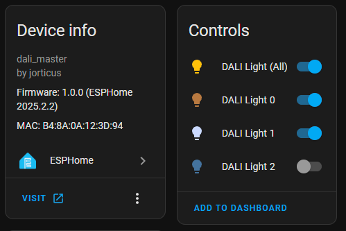
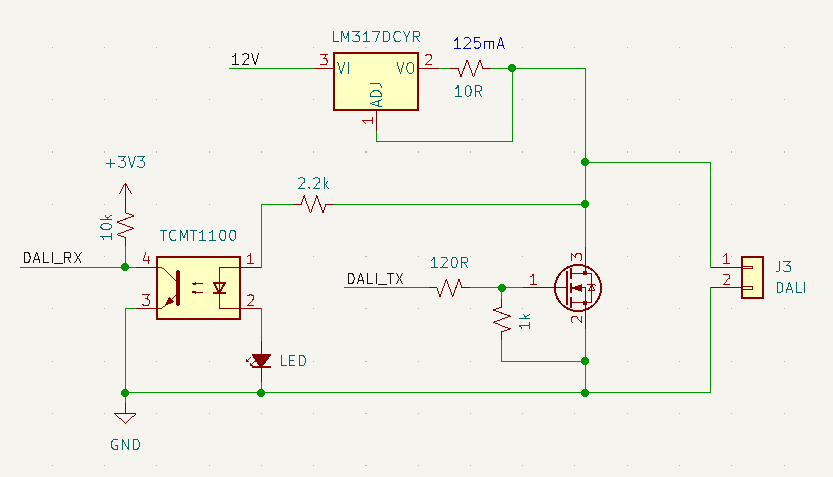

# ESPHome DALI Master Component

This component implements a DALI master that can talk to devices on a DALI bus.


## Supported Features:

- Automatic device discovery & address assignment
- DALI dimmer support
  - brightness control
  - colour temperature control
- Broadcast or short address
- Query device capabilities 
  - `dali.light` component automatically enables colour temperature if device reports the capability
- DALI parameter configuration
  - Fade rate/time
  - Brightness curve (log/linear)

## Usage:

Lights can be automatically discovered on the bus by simply defining a dali bus component:

```yaml
# bit-banged 1200 baud DALI bus
dali:
  id: dali_bus
  tx_pin: 4
  rx_pin: 12

  # Lights will be created for each detected DALI light device
  discovery: true

  # Devices will be automatically assigned a short address if they do not have one
  initialize_addresses: true
```



If you do not want to use automatic discovery, or want to customize a specific light,
you can specify the light component with an address like so:

```yaml
light:
- platform: dali
  id: dali_light
  name: "DALI Light"
  address: 0 # Short address, group address, or omit for broadcast
  restore_mode: RESTORE_DEFAULT_ON 

  # Set the brightness curve on the device
  brightness_curve: LOGARITHMIC # (default)

  # Force a specific color mode, irrespective of what the device claims.
  color_mode: COLOR_TEMPERATURE # (default: auto detect)

  # Update the fade time/rate on the device
  fade_time: 1s
  fade_rate: 44724  # steps/second
```

## Future Work:

- [ ] Support scenes & groups
- [X] Allow configuration of DALI device parameters
- [X] Automatic device discovery
- [X] Automatic address assignment
- [ ] Support for RGB(W) devices
- [ ] Hardware protocol support (no bit banging)

## Components

### dali

The main dali copmonent implements the low level bus interface via bit-bang protocol.

The dali bus implements a simple bit-banged protocol, but you can extend it with a better implementation
for your platform (eg, DMA, interrupt based).

```yaml
dali:
  tx_pin: <transmit pin>
  rx_pin: <receive pin>
```

### dali.light

The dali light component supports both specific device addressing (short address), addressing groups, and broadcast.

NOTE: Querying capabilities is only supported if a specific device address is provided.

If an address is provided, it will query the device for its capabilities, and enable the appropriate
features such as colour temperature control.

```yaml
light:
- platform: dali
  address: <short address, group address, or broadcast(0xFF)>

  # For UI display purposes only:
  cold_white_color_temperature: 6000K
  warm_white_color_temperature: 2700K
```

### dali.output

The dali output component implements a float output that broadcasts the value as a brightness level

```yaml
output:
  - platform: dali
```

It has no configurable parameters.

## Wiring

The minimum viable schematic for interfacing with the bus looks like this:



This is NOT compliant with the spec, but will work...

The spec requires 16V with a fast-response ~200mA current limiter implemented with a BJT current source,
and dual opto-isolators. However since the bus is connected to a non-isolated power supply, we can get away without opto-isolation, except as convenience for converting the DALI voltage levels to a safe 3.3 logic level.

There are other ways to implement the current limiter too, as long as they have a quick response time.
I succsessfully used an opamp current limiting circuit as I didn't have an LM317 or BJT on hand. 
It has been noted elsewhere that if using a LM317, it MUST be an on-brand chip, and preferably the `LM317DCYR` from Texas Instruments.

I will later be releasing a Kicad project for a DALI bus adapter board that more closely follows the spec.

## Device Support

The following devices have been tested with this library:

- EOKE BK-DWL060-1500AD (63W CCT LED Driver, min brightness 86)
- LTECH LM-75-24-G2D2 (75W CCT LED Driver, 1000:1 dimming range)
- LTECH MT-100-650-D2D1-A1 (48VDC CCT LED Driver PCB Module)
